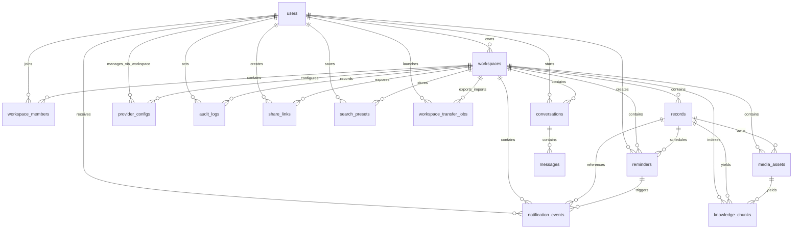

# SelfControl ERD 与数据结构说明

## 1. 设计目标

当前数据模型需要同时满足以下目标：

- 单用户自用优先，但天然支持多人共享工作区
- 记录对象长期可扩展，不被“饮食备忘”单一场景锁死
- 文本、图片、音频、视频统一挂到记录之下
- OCR / ASR / 视频转写结果能够沉淀为可检索知识
- AI provider、地图 provider、媒体存储 provider 均可拆分替换
- 满足后续企业级维护、迁移、审计、权限控制和运维要求

## 2. 核心关系图



## 3. 表级说明

### 3.1 `users`

用途：

- 系统登录主体
- 当前支持账号密码
- 未来可继续扩展手机号、验证码、SSO 等方式

核心字段：

- `id`
- `email`
- `username`
- `password_hash`
- `display_name`
- `created_at`
- `updated_at`

约束：

- `email` 唯一
- `username` 唯一

### 3.2 `workspaces`

用途：

- 数据隔离的第一边界
- 未来多人共享、权限和分享能力都围绕工作区展开

核心字段：

- `id`
- `name`
- `slug`
- `owner_id`
- `visibility`
- `created_at`
- `updated_at`

约束：

- `slug` 唯一

### 3.3 `workspace_members`

用途：

- 表示用户与工作区的成员关系
- 支持角色控制

核心字段：

- `id`
- `workspace_id`
- `user_id`
- `role`
- `created_at`

约束：

- `(workspace_id, user_id)` 唯一

当前角色：

- `owner`
- `editor`
- `viewer`

### 3.4 `records`

用途：

- 通用记录主表
- 不把业务模型拆成多个子表，而是通过 `type_code + extra_data` 保留长期扩展性

核心字段：

- `id`
- `workspace_id`
- `creator_id`
- `type_code`
- `title`
- `content`
- `rating`
- `is_avoid`
- `occurred_at`
- `source_type`
- `status`
- `extra_data`
- `created_at`
- `updated_at`

已落地扩展点：

- `type_code` 可承载 `food`、`snack`、`drink`、`memo` 等不同记录对象
- `is_avoid` 用于“踩雷”与避坑记录
- `source_type` 用于区分手工创建、聊天创建等来源
- `extra_data` 用于容纳位置、复核状态、历史轨迹等非固定字段

### 3.5 `media_assets`

用途：

- 挂载记录下的图片、音频、视频和其他附件
- 同时支持本地存储与远端 webhook 存储

核心字段：

- `id`
- `workspace_id`
- `record_id`
- `uploaded_by`
- `media_type`
- `storage_provider`
- `storage_key`
- `original_filename`
- `mime_type`
- `size_bytes`
- `metadata_json`
- `processing_status`
- `processing_error`
- `extracted_text`
- `processed_at`
- `created_at`
- `updated_at`

说明：

- `storage_provider` 当前主要为 `local` 或 `custom`
- `metadata_json` 用于保留尺寸、哈希、远端状态、重试状态、归档层级等信息
- `extracted_text` 是媒体转成知识库的关键入口

### 3.6 `knowledge_chunks`

用途：

- RAG 向量知识表
- 将记录正文与媒体提取文本切片后统一入库

核心字段：

- `id`
- `workspace_id`
- `record_id`
- `media_id`
- `source_type`
- `source_label`
- `chunk_index`
- `content`
- `content_hash`
- `embedding_provider`
- `embedding_model`
- `embedding_dimensions`
- `embedding_vector`
- `metadata_json`
- `created_at`
- `updated_at`

索引重点：

- `workspace_id`
- `record_id`
- `media_id`

说明：

- `media_id` 可为空，表示该片段来源于记录正文
- `embedding_vector` 当前存为 JSON，配合当前服务逻辑完成召回
- 后续如果切换到更重型向量索引方案，优先保持接口兼容而不是改业务语义

### 3.7 `conversations`

用途：

- 每个用户在工作区内的聊天会话

核心字段：

- `id`
- `workspace_id`
- `user_id`
- `title`
- `created_at`
- `updated_at`

### 3.8 `messages`

用途：

- 聊天消息明细

核心字段：

- `id`
- `conversation_id`
- `role`
- `content`
- `metadata_json`
- `created_at`

说明：

- `metadata_json` 可承载助手模式、工具调用结果摘要、结构化补充信息

### 3.9 `reminders`

用途：

- 对记录创建时间相关提醒

核心字段：

- `id`
- `workspace_id`
- `record_id`
- `created_by`
- `channel_code`
- `title`
- `message`
- `remind_at`
- `status`
- `is_enabled`
- `delivered_at`
- `cancelled_at`
- `metadata_json`
- `created_at`
- `updated_at`

说明：

- 当前 `channel_code` 以站内提醒为主
- 未来可扩展短信、邮件、Webhook 等通道

### 3.10 `notification_events`

用途：

- 站内通知中心
- 当前主要由提醒到期产生

核心字段：

- `id`
- `workspace_id`
- `user_id`
- `reminder_id`
- `record_id`
- `title`
- `message`
- `event_type`
- `status`
- `is_read`
- `read_at`
- `metadata_json`
- `created_at`
- `updated_at`

### 3.11 `provider_configs`

用途：

- 按工作区保存 feature 级 provider 配置

核心字段：

- `id`
- `workspace_id`
- `feature_code`
- `provider_code`
- `model_name`
- `is_enabled`
- `api_base_url`
- `api_key_env_name`
- `options_json`
- `created_at`
- `updated_at`

约束：

- `(workspace_id, feature_code)` 唯一

当前 feature 范围：

- `chat_generation`
- `embeddings`
- `image_ocr`
- `audio_asr`
- `video_transcription`
- `maps_geocoding`
- `media_storage`

安全边界：

- 数据库只保存密钥环境变量名，不保存明文密钥

### 3.12 `audit_logs`

用途：

- 审计关键行为
- 为安全排查、企业级追踪和回放定位提供基础

核心字段：

- `id`
- `workspace_id`
- `actor_user_id`
- `action_code`
- `resource_type`
- `resource_id`
- `status`
- `message`
- `metadata_json`
- `created_at`

### 3.13 `share_links`

用途：

- 公开分享入口
- 通过 token 引导其他用户加入工作区

核心字段：

- `id`
- `workspace_id`
- `created_by`
- `name`
- `token_hash`
- `token_hint`
- `permission_code`
- `is_enabled`
- `expires_at`
- `max_uses`
- `use_count`
- `last_used_at`
- `created_at`
- `updated_at`

说明：

- 只存 `token_hash`，降低泄露风险

### 3.14 `search_presets`

用途：

- 保存高频筛选条件

核心字段：

- `id`
- `workspace_id`
- `created_by`
- `name`
- `filters_json`
- `created_at`
- `updated_at`

当前 `filters_json` 主要承载：

- `query`
- `type_code`
- `is_avoid`
- `place_query`
- `review_status`
- `mapped_only`

### 3.15 `workspace_transfer_jobs`

用途：

- 大型导入导出作业跟踪

核心字段：

- `id`
- `workspace_id`
- `created_by`
- `job_type`
- `status`
- `payload_json`
- `result_json`
- `artifact_path`
- `artifact_filename`
- `error_message`
- `created_at`
- `updated_at`
- `completed_at`

说明：

- 当前支持 `export` 与 `import`
- 用于避免大体积工作区迁移阻塞前端请求

## 4. `records.extra_data` 结构约定

`records.extra_data` 是长期扩展的关键，当前推荐保持以下结构语义：

```json
{
  "location": {
    "place_name": "某家店",
    "address": "详细地址",
    "latitude": 30.2741,
    "longitude": 120.1551,
    "source": "manual"
  },
  "location_review": {
    "status": "confirmed",
    "note": "手动纠正为门店正门",
    "updated_at": "2026-03-29T12:00:00+00:00",
    "updated_by": "user-id",
    "confirmed_at": "2026-03-29T12:00:00+00:00"
  },
  "location_history": [
    {
      "changed_at": "2026-03-29T11:59:00+00:00",
      "changed_by": "user-id",
      "action_code": "set",
      "review_status": "pending",
      "place_name": "某家店",
      "latitude": 30.2741,
      "longitude": 120.1551,
      "source": "amap"
    }
  ]
}
```

当前后端会对以下内容做标准化：

- `location.place_name`
- `location.address`
- `location.latitude`
- `location.longitude`
- `location.source`
- `location_review.status`
- `location_review.note`
- `location_history`

当前支持的地点复核状态：

- `pending`
- `confirmed`
- `needs_review`

## 5. 导出包结构

工作区导出当前采用 `workspace-export-v1` 规范，导出产物至少包含：

- 工作区基础信息
- 成员列表
- 记录列表
- 媒体元数据
- 可用的本地媒体文件
- `manifest.json`

显式不导出：

- provider 明文密钥
- 分享 token 明文
- 不必要的敏感运行时状态

## 6. 模型演进原则

后续继续扩展数据库结构时，优先遵循以下原则：

1. 以 `workspace_id` 作为多租户与权限隔离基线。
2. 记录主表尽量保持稳定，避免按业务场景不断裂变出一批新主表。
3. 高波动、强扩展字段优先收敛在 `extra_data` 或专用附属表。
4. 涉及存储、AI、分享、导入导出等高风险流程时必须保留审计面。
5. 任何 schema 变更都必须同步 Alembic、测试、文档和部署校验。

## 7. 当前已知后续方向

当前结构已经为以下后续能力保留空间：

- 多人长期协作
- 更强的地图 provider 国际化切换
- 更复杂的助手工具调用
- 更完整的通知通道
- 更大规模的媒体冷存储与对象存储接入
- 更强的向量索引后端替换
